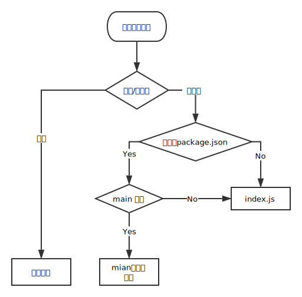

[TOC]

## 基本配置

### 入口文件 entry

* 单入口

	``` js
	entry: {
		main: './src/index.js'
	}
	```
* 多入口
  
	``` js
	entry: {
		foo: './src/page-foo.js',
		bar: './src/page-bar.js',
	}
	```

### 处理多种文件格式 loader
	最终把不同格式文件都解析成js文件，以便打包后在浏览器中运行。

``` js
module: {
	rules: [
		{
			test: /\.jsx?/,
			includes: [
				path.resolve(__dirname, 'src') // 指定那些路径下的文件需要经过 loader 处理
			],
			use: 'babel-loader', // 指定使用的 loader
		}
	]
}

```

### 插件 plugin 

例如： 压缩js代码

``` js
const UglifyPlugin = require('uglifyjs-webpack-plugin')

module.exports = {
	  plugins: [
	    	new UglifyPlugin()
	  ],
}
```

### 输出 output

* 常规
	
	``` js
	output: {
		path: path.resolve(__dirname, 'dist'),
		filename: 'bundle.js'
	}
	```
	
* 多入口	生成不同文件

	``` js
	entry: {
		foo: './src/foo.js',
		bar: './src/bar.js',
	},
	output: {
		filename: '[name].js',
		path: __dirname + '/dist',
	}


	```

* 配置hash

	``` js
	// 路径中使用 hash，每次构建时会有一个不同 hash 值，避免发布新版本时线上使用浏览器缓存
	output: {
		filename: '[name].js',
		path: __dirname + '/dist/[hash]',
	}
	```

## 搭建基本开发环境

### 关联 HTML - html-webpack-plugin

``` js
plugins: [
	new HtmlWebpackPlugin({
		filename: 'index.html', // 配置输出文件名和路径
		template: 'assets/index.html', // 配置文件模板
	}),
]
```

### 构建 CSS

* css-loader: 负责解析css代码，主要是为了处理css依赖，例如 @import 和 url() 等。
* style-loader：会将css-loader解析的结果转变为js代码，运行时动态插入style标签让css代码生效。

``` js
{
	test: /\.css/,
	include: [
	  path.resolve(__dirname, 'src'),
	],
	use: [
	  'style-loader',
	  'css-loader'
	]
}
```
经过以上处理后，css会转变为JS，和index.js一起打包。

单独把 css 文件分离出来：
`extract-text-webpack-plugin`（目前需要安装"4.0.0-beta.0"版本）,  修改上述配置：

``` js
const ExtractTextPlugin = require('extract-text-webpack-plugin')

module = {
	rules: [
		{
			test: /\.css$/,
			use: ExtractTextPlugin.extract({
				fallback: 'style-loader',
				use: 'css-loader'
			})
		}
	]
}

plugins: [
	<!--分离css-->
      new ExtractTextPlugin('index.css')
]
```

### CSS 预处理器

例如： Less

``` js
{
	test: /\.less$/,
		use: ExtractTextPlugin.extract({
		fallback: 'style-loader',
		use: [
			'css-loader',
			'less-loader'
		]
	})
}
```

### 处理图片文件 file-loader

作用：直接输出文件，把构建后的文件路径返回

``` js
{
	test: /\.(png|jpg|gif)$/,
	use: [
		{
			loader: 'file-loader',
			options: {}
		}
	]
}
```

### 启动静态服务 webpack-dev-server

在package.json中添加命令：

``` json
"scripts": {
	"build": "webpack --mode production",
	"start": "webpack-dev-server --mode development"
}
```
默认访问地址： http://localhost:8080/

## 如何解析代码模块路径
webpack构建时，会解析依赖后，再去加载依赖的模块文件。

> 在 JavaScript 中尽量使用 ECMAScript 2015 Modules 语法来引用依赖。

`enhanced-resolve`:  处理依赖模块路径的解析。
> 这个模块可以说是 Node.js 那一套模块路径解析的增强版本，有很多可以自定义的解析配置。
> 
> 参考：[深入Node.js的模块机制](http://www.infoq.com/cn/articles/nodejs-module-mechanism)

###  模块解析规则



* 解析相对路径
	* 查找相对当前模块的路径下是否有对应的文件或文件夹
	* 文件 -- 直接加载
	* 文件夹 -- 继续查找文件夹下的package.json文件
	* 有package.json且文件中有main字段（main字段是可配置的，并不总是main字段），则按照main字段的文件名查找文件
	* 没有package.json 或者 没有main 字段，则查找index.js
	 
* 解析模块名
	
	查找当前文件目录下，父级目录及以上目录下的 `node_modules` 文件夹,  看是否有对应的模块。
	
* 解析绝对路径 （不建议）
	
	直接查找对应路径的文件

webpack 中和模块路径解析相关的配置都在resolve字段下：

``` js
module.exports = {
	resolve: {
		// ...
	}
}
```

### 常用配置

* resolve
	* alias：配置模块别名
	* extensions：补全后缀名
	* modules：解析模块时应该搜索哪些目录
	* mainFields：确定package.json检查哪些字段（如 main 字段）
	* mainFiles： 解析目录时使用的文件名
	* resolveLoader: 配置